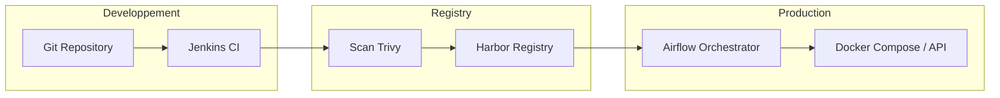

# MLOps Directives for Wine Quality Project

## 1. Structure du Projet
- Organiser le code en modules clairs (`data_ingestion`, `preprocessing`, `training`, `evaluation`, `serving`).
- Utiliser un fichier `config.yaml` pour centraliser les hyperparamètres et les chemins.

## 2. Versionnage (Data & Model)
- **DVC (Data Version Control)** : Utiliser DVC poour versionner le dataset `winequality-red.csv` et les modèles générés (`.pkl`).
- **Git** : Garder uniquement le code et les fichiers de configuration dans Git.

## 3. Tracking des Expériences et Orchestration
- **MLflow** : _(Optionnel mais recommandé)_ Pour enregistrer les paramètres, les métriques (Accuracy, F1-score) et les artefacts de chaque entraînement. Il permet de comparer visuellement les performances des modèles.
- **Apache Airflow** : Pour orchestrer le workflow MLOps complet. Au lieu de simples scripts, définissez un DAG (Directed Acyclic Graph) pour :
    1. Vérifier la disponibilité des données.
    2. Lancer l'entraînement.
    3. Exécuter les tests de validation.
    4. Déclencher le déploiement si les métriques sont bonnes.

## 4. Pipeline CI/CD (Jenkins)
- **Stage Linting** : Ajouter un check `pylint` ou `flake8`.
- **Stage Unit Tests** : Renforcer `tests/test_predict.py`.
- **Stage Data Validation** : Utiliser `Great Expectations` pour vérifier la qualité des données entrantes.
- **Stage Training** : Extraire l'entraînement du Dockerfile vers un job Jenkins dédié qui produit un artefact (modèle).
- **Stage Model Validation** : Vérifier que la nouvelle accuracy dépasse un seuil minimal.

## 5. Déploiement et Serving
- **FastAPI / Flask** : Transformer `predict.py` en une API REST pour permettre des prédictions en temps réel.
- **Docker Compose** : Créer un fichier `docker-compose.yml` pour orchestrer l'API et potentiellement une base de données ou un outil de monitoring.

## 6. Flux MLOps Complet (Intégration Jenkins + Harbor + Airflow)

Voici comment orchestrer l'ensemble de la chaîne :

### Étape 1 : CI avec Jenkins
- **Trigger** : Un commit sur Git (ou un tag).
- **Actions** : Jenkins exécute le `Jenkinsfile`.
    - Il construit l'image Docker (qui entraîne le modèle).
    - Il scanne l'image avec Trivy (sécurité).
    - Il **push** l'image sur votre registre **Harbor** (`192.168.43.53/mlops/wine-quality:latest`).

### Étape 2 : Stockage sur Harbor
- Harbor conserve vos versions de modèles encapsulées dans des images Docker. Vous avez une traçabilité complète entre le code et l'image produite.

### Étape 3 : Orchestration avec Airflow
- **Ré-entraînement programmé** : Airflow peut être configuré pour déclencher un job Jenkins périodiquement si de nouvelles données sont arrivées dans `/data`.
- **Déploiement (CD)** : Le DAG Airflow `wine_quality_mlops_pipeline` effectue le `docker compose pull && docker compose up -d`.
    - Airflow s'assure que la machine de production récupère la dernière image stable depuis Harbor et la déploie.

### Architecture Recommandée

## 7. Monitoring et Feedback Loop
- **Prometheus/Grafana** : Monitorer l'utilisation de l'API et les performances du modèle (Data Drift).
- Mettre en place un système de feedback pour collecter les vrais résultats et ré-entraîner le modèle périodiquement via Airflow.
